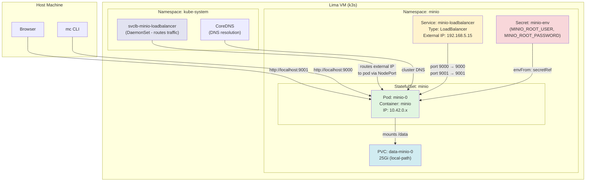

# MinIO on Kubernetes

Deploy MinIO object storage as a plain StatefulSet — no operator overhead.

## Architecture



## How Traffic Flows

```
Browser (host) → localhost:9001 → kubectl port-forward → Pod:9001 (Console)
mc CLI (host)  → localhost:9000 → kubectl port-forward → Pod:9000 (API)
```

The LoadBalancer external IP (`192.168.5.15`) exists but is **not reachable from the host** because the Lima VM runs on an isolated network. Use `kubectl port-forward` instead.

## File Structure

```
minio/
├── deployment.yaml      # Namespace + StatefulSet
├── loadbalancer.yaml    # LoadBalancer service
├── secrets.yaml         # Credentials (gitignored - DO NOT commit)
├── .gitignore
└── README.md
```

## Prerequisites

- A running Kubernetes cluster (k3s, kind, minikube, etc.)
- `kubectl` configured and connected to your cluster
- A `local-path` StorageClass (or update `storageClassName` in `deployment.yaml`)

## Setup

### 1. Configure credentials

Edit `secrets.yaml` and update with your credentials:

- `MINIO_ROOT_USER` — MinIO admin username
- `MINIO_ROOT_PASSWORD` — MinIO admin password

### 2. Deploy MinIO

```bash
kubectl apply -f secrets.yaml
kubectl apply -f deployment.yaml
kubectl apply -f loadbalancer.yaml
```

### 3. Verify deployment

```bash
kubectl get pods -n minio
kubectl get svc -n minio
```

Wait until the pod shows `1/1 Ready`.

## Accessing MinIO

### Via Port Forward (recommended for local dev)

```bash
kubectl port-forward svc/minio-loadbalancer -n minio 9000:9000 9001:9001
```

- **Console**: `http://localhost:9001`
- **API (S3)**: `http://localhost:9000`

### Via LoadBalancer External IP (from inside the VM only)

```bash
kubectl get svc minio-loadbalancer -n minio
```

- **Console**: `http://<EXTERNAL-IP>:9001`
- **API (S3)**: `http://<EXTERNAL-IP>:9000`

> **Note**: The external IP is on the Lima VM's isolated network and is not reachable from the host machine. Use port-forwarding instead.

### Via NodePort (from inside the VM only)

- **Console**: `http://<NODE-IP>:31404`
- **API (S3)**: `http://<NODE-IP>:30461`

## Using the MinIO Client (mc)

### Install mc

```bash
# Linux
curl https://dl.min.io/client/mc/release/linux-amd64/mc -o /usr/local/bin/mc
chmod +x /usr/local/bin/mc

# macOS
brew install minio/stable/mc
```

### Configure alias

```bash
mc alias set myminio http://localhost:9000 jimoney kayole12A
```

Replace `localhost:9000` with your actual endpoint if not using port forwarding.

### Common commands

```bash
mc ls myminio                           # List buckets
mc mb myminio/mybucket                  # Create a bucket
mc cp file.txt myminio/mybucket         # Upload a file
mc cp myminio/mybucket/file.txt .       # Download a file
mc rm myminio/mybucket/file.txt         # Delete a file
mc admin info myminio                   # Server info
mc admin user list myminio              # List users
mc policy set download myminio/mybucket # Make bucket publicly readable
```

## Troubleshooting

### Pod not ready

```bash
kubectl describe pod -n minio -l app=minio
kubectl logs -n minio -l app=minio
```

### Pod crashes with "parity validation" error

This happens when `MINIO_STORAGE_CLASS_STANDARD` is set to `EC:2` but you only have 1 drive. Erasure coding requires at least 3 drives.

**Fix**: Remove `MINIO_STORAGE_CLASS_STANDARD` from `secrets.yaml`, delete the secret and PVC, then redeploy:

```bash
kubectl delete secret minio-env -n minio
kubectl delete pvc -n minio --all
kubectl delete pv -l app=minio --all 2>/dev/null
rm -rf /home/jimoney/minio/data/.minio.sys  # wipe persisted config
kubectl apply -f secrets.yaml
kubectl apply -f deployment.yaml
```

### "Client sent an HTTP request to an HTTPS server"

This happens when using port 9443 — browsers auto-upgrade to HTTPS. The console is now on port 9001 (HTTP) to avoid this.

**Fix**: Use `http://localhost:9001` instead of `https://localhost:9443`.

### No external IP on LoadBalancer

Some clusters (kind, minikube, bare-metal) don't support LoadBalancer out of the box. Use port forwarding instead.

### Node instability / pods restarting

On resource-constrained VMs (8GB RAM), pods may restart due to memory pressure. Reduce cluster footprint:

```bash
kubectl scale deployment metrics-server -n kube-system --replicas=0
```

### Reset deployment

```bash
kubectl delete -f loadbalancer.yaml
kubectl delete -f deployment.yaml
kubectl delete -f secrets.yaml
kubectl delete namespace minio
```

Then re-apply from step 2.

## What Was Avoided

This setup deliberately **does not use the MinIO Operator** because:

- The operator adds ~256Mi RAM overhead (operator pod + sidecar container)
- On a single-node, 8GB RAM system, every MB counts
- The operator caused connectivity issues with `requestAutoCert: true` (self-signed certs only valid for internal DNS)
- With `requestAutoCert: false`, the operator bound MinIO to `127.0.0.1` only, breaking all external access
- A plain StatefulSet is simpler, uses fewer resources, and works reliably for homelab use
